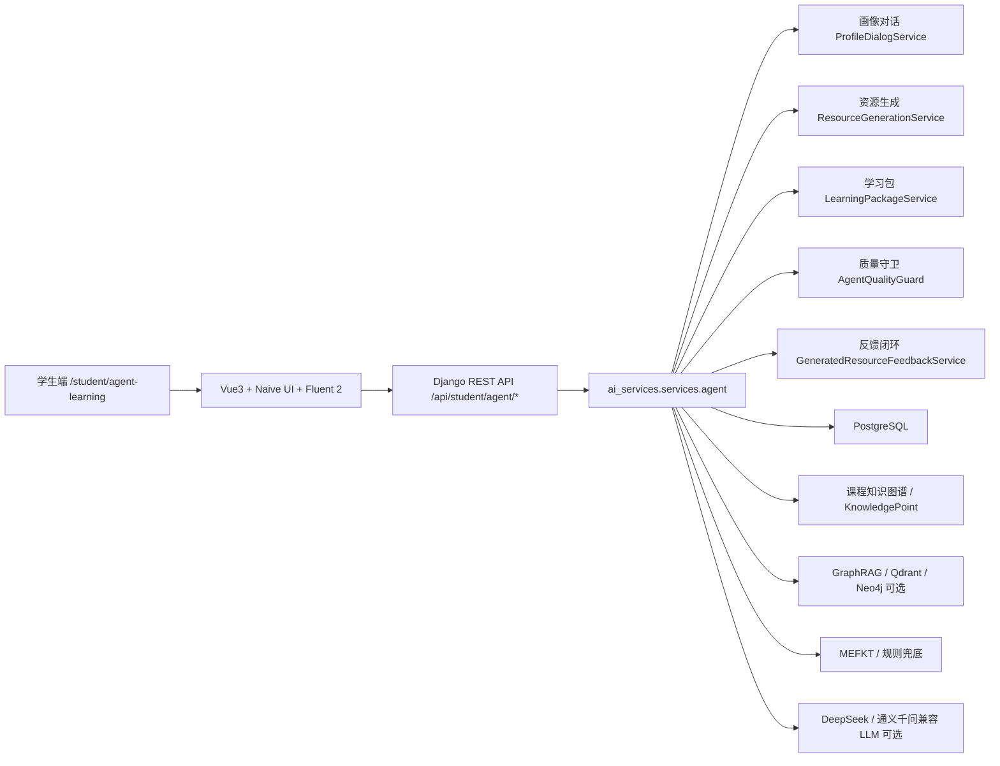
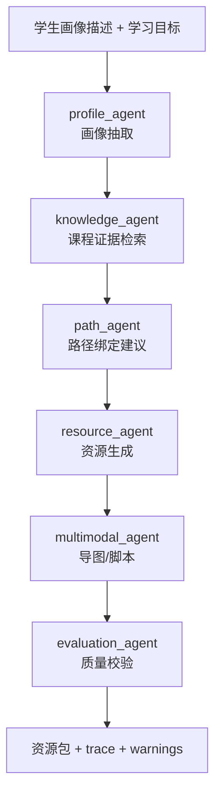
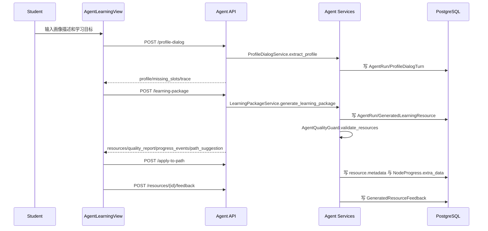

# A3 系统架构与 AI 能力边界说明

## 1. 总体架构图

## 2. 前端架构

- 路由入口：`frontend/src/router/routes/student.ts`。
- A3 页面：`frontend/src/views/student/AgentLearningView.vue`。
- API 封装：`frontend/src/api/student/agent.ts`。
- 组件：
  - `frontend/src/components/agent/AgentRunTimeline.vue`
  - `frontend/src/components/agent/GeneratedResourceCard.vue`
  - `frontend/src/components/agent/EvidenceDrawer.vue`
  - `frontend/src/components/agent/ResourceFeedbackPanel.vue`

页面只负责表单、状态展示和调用 API；画像抽取、资源生成、路径绑定和质量规则都在后端 service 层完成。

## 3. 后端应用与服务分层

- Django 配置入口：`backend/adaptive_edu_api/settings.py`。
- 后端 URL 聚合：`backend/adaptive_edu_api/urls.py`。
- AI 路由：`backend/ai_services/urls.py`。
- 学生端 Agent View：`backend/ai_services/api/student/agent.py`。
- Agent 服务：`backend/ai_services/services/agent/`。
- 数据模型：`backend/ai_services/models.py` 与 `backend/learning/models.py`。

架构边界：

- View 只做权限、参数校验和统一响应。
- Service 承担 Agent 编排、证据收集、质量校验和反馈写入。
- Model 不触发外部推理。
- Serializer 不做复杂图谱查询。

## 4. 多智能体服务边界

当前实现使用同步服务编排并返回结构化 `agent_trace`，未引入 Celery、SSE 或 WebSocket。后续如流程变长，可保留相同数据结构并切换为异步运行。

## 5. GraphRAG / KG / KT / LLM 协作关系

- PostgreSQL：用户、课程、班级、知识点、资源、题库、学习路径、Agent 运行记录和生成资源。
- Neo4j：知识图谱增强查询，可不可用；未配置时保留 PostgreSQL 图谱回退。
- Qdrant：GraphRAG 本地向量库，默认运行产物在 `backend/runtime_logs/rag/qdrant/`。
- GraphRAG：从课程资料和图谱中召回证据，作为资源生成和问答依据。
- MEFKT：输出掌握度和薄弱点；模型不可用时使用内置统计和规则兜底。
- LLM：用于自然语言表达增强；不可用时资源生成使用模板化内容。

## 6. 数据存储与运行产物

| 数据 | 存储位置 | 是否提交 |
| --- | --- | --- |
| AgentRun / GeneratedLearningResource | PostgreSQL | 运行数据不直接提交 |
| 课程知识点和资源 | PostgreSQL，由工具导入 | 测试资产可提交 |
| GraphRAG 索引 | `backend/runtime_logs/rag/` | 不提交 |
| MEFKT 模型 | `backend/models/MEFKT/` | 当前仓库内基线模型可提交 |
| 前端构建产物 | `frontend/dist/` | 不提交 |
| 依赖目录 | `node_modules/`、`.venv/` | 不提交 |

## 7. 生成资源与学习路径数据流

## 8. 异常降级与安全边界

- 课程证据为空：返回 `warnings`，不伪造来源。
- LLM 不可用：使用模板化资源内容。
- GraphRAG 或 Neo4j 不可用：优先使用 PostgreSQL 课程知识点和课程资源。
- 学生无课程权限：返回 403，不泄露其他课程数据。
- 非学生角色访问学生 Agent API：返回 403。
- 密钥只读取 `backend/.env`，文档和日志不记录真实 API Key。

## 9. 关键目录和代码入口

| 模块 | 路径 |
| --- | --- |
| Agent API | `backend/ai_services/api/student/agent.py` |
| Agent 服务 | `backend/ai_services/services/agent/` |
| Agent 测试 | `backend/ai_services/tests/student/test_agent_api.py` |
| 学习路径模型 | `backend/learning/models.py` |
| 课程知识库模型 | `backend/knowledge/models.py` |
| 学生端页面 | `frontend/src/views/student/AgentLearningView.vue` |
| OpenAPI 路径 | `docs/openapi/paths/student_agent.yaml` |

## 10. 后续扩展方向

- 把同步学习包生成迁移为后台任务并支持前端实时进度。
- 增加教师审核和学生多轮追问。
- 将生成资源纳入长期资源库或学习包导出。
- 增加真实视频、语音或 PPT 生成能力。
