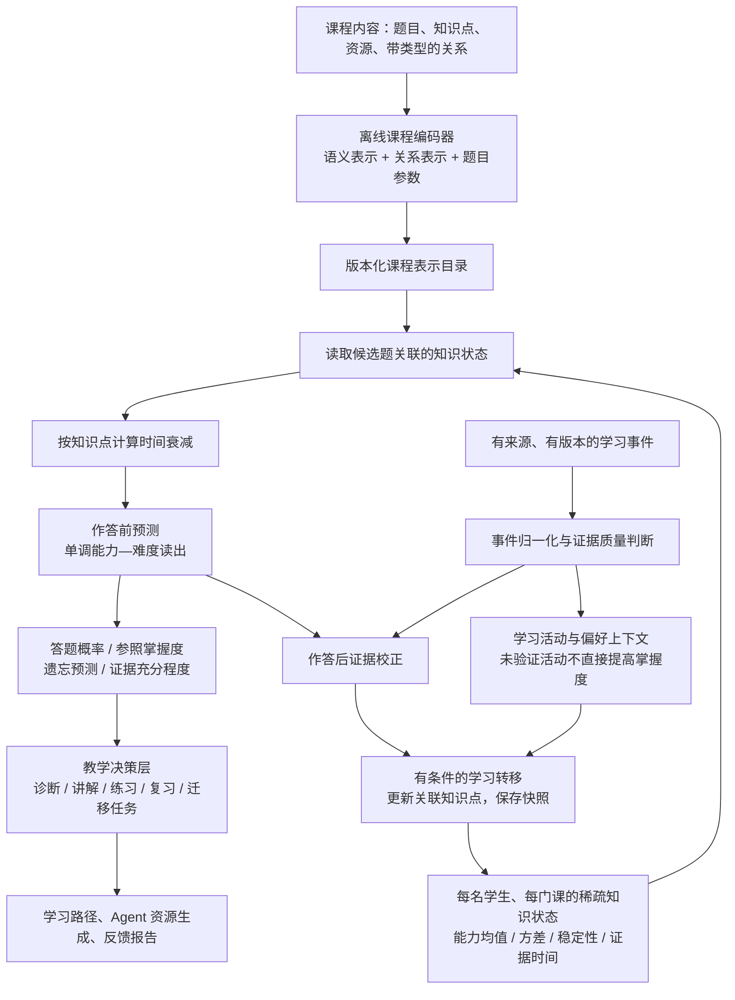

<!--
MEFKT 下一代模型设计总览
@Project : adaptive-edu
@File : README.md
@Author : Qintsg
@Date : 2026-09-23
-->

# MEFKT 下一代架构设计

> 状态：整体架构仍为设计提案；[阶段 B 首次 prd 训练](TRAINING_RESULT_20260924.md) 与[四来源扩充训练](TRAINING_RESULT_4SRC_20260924.md)已完成，并形成独立测试集结果；模型尚未接入线上，也未完成全部设计阶段。设计代号为 **MEFKT-NG**；沿用项目 MEFKT 名称，不表示复现某篇论文，也不覆盖现有模型版本。

新增 EdNet 与 Junyi 的来源、许可证、转换和独立续训边界见[数据扩充记录](DATA_EXPANSION_20260924.md)。

四来源训练的同配置追加轮次见[续训记录](TRAINING_CONTINUATION_20260924.md)。

本机过程数据、纯权重包、过拟合诊断和上线替换条件见[模型替换前交接](MODEL_REPLACEMENT_PREPARATION_20260924.md)。

新权重作为后端默认模型接入的实现和显式旧版回滚方式见[MEFKT-NG 后端适配](BACKEND_NG_ADAPTER_20260925.md)。

## 1. 核心决定

将 MEFKT 设计为**由学习证据驱动、按知识点维护状态、能够表达遗忘和不确定性的知识追踪模型**。模型先回答“学生对哪些知识有多少可信证据”，再回答“这道题能否完成”和“现在适合采取什么教学行动”。

推荐主干为：

**课程语义与关系编码 → 稀疏知识状态 → 连续时间遗忘 → 单调作答预测 → 证据校正 → 有条件的学习转移。**

其中，路径与资源推荐是状态的消费者。LLM 负责组织讲解，不能直接改写掌握度；资源完成和满意度也不能自动变成“答对一次”。

这次设计以项目适配为首要取舍，兼顾可验证的研究方向。保留现有需求中的新课程接入、CPU 轻量推理和 Full 推理显存不超过 8 GiB 的目标；这些是后续验收约束，不是本方案已经达成的性能。

## 2. 从项目需求推出模型能力

| 项目需求 | 模型必须提供什么 | 架构决定 |
| --- | --- | --- |
| 初始测评与薄弱点诊断 | 区分不会、未测和证据冲突 | 知识状态同时保存能力估计与方差 |
| 动态学习路径 | 可比较的掌握度、先修准备度 | 固定参照题口径；准备度与掌握度分开 |
| 阶段测试和作业 | 答对概率及部分得分预测 | 二元主头，按数据条件启用有序得分头 |
| 多知识点题目 | 一次作答共同约束多个知识点 | 一个观测似然，按敏感度分配更新 |
| 视频、阅读、实操与生成资源 | 表达接触了什么，以及是否验证了学习 | 分离学习活动记录与能力测量证据 |
| 遗忘与复习安排 | 在指定未来时间估计可用知识状态 | 每个知识点独立计时、独立稳定性 |
| 新课程直接接入 | 不依赖固定题目/知识点参数表 | 内容编码共享，状态按课程内稳定标识寻址 |
| AI 画像与资源生成 | 可以引用的结构化诊断和证据 | 输出证据 ID、状态来源、版本与限制 |
| 小规模部署 | 在线推理轻，故障时仍可用 | Lite 优先；课程表示离线缓存；统计回退 |

事实依据是 [项目说明](../../README.md)、[A3 需求](../a3/PRD.md)、[课程数据说明](../a3/数据与知识库说明.md) 及当前代码，而不是将已有架构文档作为设计上限。

## 3. 现有工程给出的重要约束

1. [Question](../../backend/assessments/entities/question.py) 已有题干、题型、难度、多知识点映射及分值；[KnowledgePoint](../../backend/knowledge/models.py) 已有描述、认知维度、教学目标和多种关系。可以建立语义与图结构联合表示。
2. [AnswerHistory](../../backend/assessments/entities/history.py) 有正确性、得分和写入时间，但没有逐题真实耗时、提示次数、反馈展示时间和作答实例 ID。不能假定这些字段已经可靠采集。
3. [生成资源反馈](../../backend/ai_services/models.py) 有完成状态、评分、主观难度、`quiz_result` 和资源级耗时；资源级耗时不等于答题耗时。`quiz_result` 也不是经过统一评分校验的逐题证据。
4. [题目级在线推理](../../backend/ai_services/services/mefkt/question_online.py) 存在将关联题目概率平均为掌握度的路径。题库难度组成变化可能改变这个数值，新方案需要固定参照口径。
5. [路径规则](../../backend/learning/paths/rules.py) 存在先修掌握度截断，以及 `0.85` 自动完成、`0.60` 先修门槛。新模型不能只替换数值而继续默用旧阈值。
6. [v3 训练模型](../../backend/scripts/mefkt_v3_models.py) 已有知识点记忆、能力—难度分解和领域校准。新增这些名称本身不足以构成重新设计。
7. [训练架构文档](../MEFKT_MODEL_ARCHITECTURE.md) 与 [在线预测器](../../backend/ai_services/services/mefkt/inference.py) 涉及不同实现路径。接入时必须确认 checkpoint 格式、预处理和运行时匹配，不能假设训练脚本产物已被在线服务直接消费。

以上是静态代码核对结果。本次未查询生产数据库，无法据此声称某个字段的真实覆盖率、样本规模或课程效果。

## 4. 总体架构

**最重要的时间边界：先用作答前状态预测，再吸收作答结果。** 没有可靠逐题顺序的整场考试，所有题目先使用共同考前状态预测，然后整批更新。

## 5. 六个核心模块

| 模块 | 输入 | 输出 | 关键约束 |
| --- | --- | --- | --- |
| 课程编码器 | 题干、知识点描述、题型、先修等关系 | 题目/知识点向量、难度与区分度先验 | 不读取未来标签；新课程不用新增模型参数 |
| 知识状态库 | 学生、课程、知识点稳定标识 | 能力均值、估计方差、稳定时间尺度、证据摘要 | 学生隔离；课程隔离；未测状态保持显式标识 |
| 时间演化器 | 保存的状态、每知识点时间差 | 当前或未来的作答前状态 | 纯查询不写状态；无新增事件时参照掌握度不增加 |
| 作答读出器 | 作答前状态与候选题参数 | 答对概率，必要时输出得分分布 | 能力提高不能降低预测；不从隐藏向量绕过状态 |
| 证据更新器 | 原预测、真实结果、评分来源、可用行为 | 诊断修正及可选学习转移 | 一次作答只消费一次；误答与噪声均可表达 |
| 教学决策适配器 | 可信状态、图谱、目标、时间与资源 | 推荐行动及理由 | 优先规则和可解释排序；学习收益需另行验证 |

## 6. 与当前模型的实质区别

| 维度 | 现有实现中的代表性做法 | 本方案 |
| --- | --- | --- |
| 模型中心 | GRU/Transformer 时序状态，加知识点记忆 | 每个知识点的显式估计分布是预测必经路径 |
| 长序列 | 编码窗口及跨窗口 memory | 主要历史已压缩进知识状态，附加短缓存只辅助更新 |
| 掌握度 | 部分在线路径平均当前关联题目的概率 | 固定版本参照题上的标准化表现估计 |
| 不确定性 | 聚合 confidence 与统计信息 | 分知识点状态方差、证据状态、课程适用性分别输出 |
| 遗忘 | 对时序隐藏状态施加衰减 | 每个知识点有独立时钟与稳定性，支持未来查询 |
| 知识图谱 | 题图编码及部分业务硬约束 | 类型化内容编码、教学准备度；不覆盖直接测验事实 |
| 学习活动 | 业务记录分散 | 统一事件语义，分清能力证据、接触记录和偏好反馈 |
| 冷启动 | 内容分支与未知类别/外部状态槽 | 共享内容模型、无碰撞状态字典、明确的适用性判断 |
| Full/Lite | GRU 加/不加完整时序 Transformer | 共享状态和读出语义，Full 增强证据更新上下文 |

## 7. 一个项目内的例子

学生希望两周内掌握 Spark SQL，系统已有 HDFS、MapReduce 和 Spark SQL 的课程图谱。

1. 学生自述“MapReduce 不太会”：进入诊断候选和学习目标，不作为测验错误标签。
2. 学生完成一个 HDFS 视频：记录接触和时间信息；没有独立测验时，不能宣布 HDFS 已掌握。
3. 学生做错一道同时涉及 HDFS 与 MapReduce 的题：模型降低相关估计，但保留归因不确定性，不将两个知识点都判为不会。
4. 系统选择能区分这两个知识点的短测。若 HDFS 的独立题持续答对而 MapReduce 答错，证据更新逐步缩小定位范围。
5. 一周后查询：按两个知识点各自的最近有效证据时间衰减，而不是因学生昨天做过其他题就认为所有知识都得到复习。
6. 若 Spark SQL 的直接测验证据较强，但 MapReduce 证据不足，保留该事实并提示先修风险，不直接将 Spark SQL 掌握度截断成 MapReduce 的数值。

这只是行为设计示例，不是实际学生预测结果。

## 8. 首版范围与扩展边界

**首版核心**：客观题/可靠评分、标量知识状态、显式遗忘、共享语义表示、类型化图关系、质量受控的证据更新、固定参照掌握度、规则教学决策、Lite 与回退。

**有数据后启用**：按学生估计稳定性、作答耗时辅助证据、部分得分头、Full 更新上下文、资源学习转移模型。

**单独研究**：认知维度拆分、跨课程知识等价迁移、学习行动的因果收益、强化学习策略。现有知识点的认知维度字段只作为内容属性；没有按认知维度评分的数据时，不直接声称能测出六维认知能力。

首版不设置独立学生 ID embedding，也不将问卷能力分或学习偏好作为固定能力标签。个人差异主要由真实交互逐步识别。

## 9. 部署规格建议

| 项目 | Lite：优先落地 | Full：效果增强候选 |
| --- | --- | --- |
| 课程内容输入 | 兼容现有 384 维缓存，记录编码器版本 | 相同 |
| 共享表示维度 | 96 | 192 |
| 知识点更新隐藏维度 | 16 | 32 |
| 状态均值/方差/稳定性 | 各 1 个标量 | 相同语义 |
| 在线历史上下文 | 最近 16 条事件的受控统计 | 最近 64 条相关事件，2 层、4 头注意力 |
| 图编码 | 离线最多 2 层关系消息传递 | 相同，可提高表示维度 |
| 单次在线图操作 | 默认不遍历全课程图 | 相同 |
| 参数预算 | 不超过 2M | 不超过 10M |
| 验收设备边界 | 少于 4 核、无 GPU；基准固定为 2 个推理线程 | 推理峰值显存不超过 8 GiB |
| 候选题计算 | 共享一次状态读取，按题目批量读出 | 相同 |

这些数字是初始配置和工程预算，没有参数量实测或延迟结果。2M/10M 只统计 KT 核心的可训练及在线驻留参数，离线文本编码器参数与课程缓存体积另报。Full 只在能稳定改善目标指标时保留；增加层数本身不视为改进。

## 10. 研究假设与可证伪标准

- **显式状态假设**：强制预测经过知识状态，能改善薄弱点定位和跨题型稳定性；用独立诊断题与去除状态约束的对照验证。
- **证据分离假设**：分离测量、学习活动与主观反馈，能减少虚假掌握度提升；用无后测的资源完成场景和延迟后测验证。
- **开放课程假设**：共享语义、局部状态和少量校准，比固定 ID 依赖更适合未见课程；用完整课程/领域留出验证。
- **遗忘假设**：知识点独立时钟比全局交互时钟更适合复习；用跨知识点交错学习和长间隔分桶验证。

这些是本项目提出的设计假设，不声称是尚无人提出的学术首创，也不预先承诺超过现有模型的 AUC。

## 11. 详细文档

1. [模型与数学定义](model.md)：状态、遗忘、题目读出、证据校正、学习转移、掌握度口径和计算复杂度。
2. [数据与工程接入](data-and-integration.md)：可用字段、事件协议、时间边界、课程冷启动、在线状态和现有调用点迁移。
3. [训练与验证设计](validation.md)：只规定未来应如何训练、比较和验收，不执行训练。
4. [首阶段训练准备](TRAINING_PREPARATION.md)：已准备的脚本、真实输入预处理核对、集群清单和完整指标留存约定。
5. [阶段 B 首次训练结果](TRAINING_RESULT_20260924.md)：153 轮完成状态、测试指标、checkpoint 选择口径与全部产物留存审计。

推荐实施顺序是先完成事件和状态契约，再实现 Lite，之后才决定是否增加 Full 与学习转移分支。旧 checkpoint 保持原有运行路径；本提案不视为兼容的权重升级。
