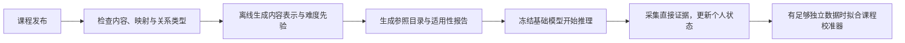

<!--
MEFKT 下一代模型的数据条件与工程接入设计
@Project : adaptive-edu
@File : data-and-integration.md
@Author : Qintsg
@Date : 2026-09-23
-->

# 数据与工程接入

> 设计草案；未修改数据库、业务代码或 HTTP 接口。本文定义内部模型边界，正式 HTTP 契约应在实施时更新 OpenAPI 3.0 并用 Redocly 校验。

## 1. 当前数据够做什么

| 数据 | 仓库依据 | 能支持的设计 | 需要注意 |
| --- | --- | --- | --- |
| 题干、选项、类型、难度、知识点 | [Question](../../backend/assessments/entities/question.py) | 内容编码、题目先验、多知识点读写 | 教师难度是弱先验，映射需核对质量 |
| 知识点描述、目标、认知维度 | [KnowledgePoint](../../backend/knowledge/models.py) | 新课程语义编码、教学任务约束 | 内容分类不能替代学生能力标签 |
| 先修、包含、相关关系 | 同上 `KnowledgeRelation` | 类型化图编码、准备度 | 环、方向和互反包含边需校验 |
| 二元结果、得分、题目/课程 ID | [AnswerHistory](../../backend/assessments/entities/history.py) | 首版能力观测 | 缺少作答实例、评分版本和得分上限快照 |
| `answered_at` | 同上，`auto_now_add` | 记录落库时间、部分事件排序 | 不能默认是真实开始/完成时间 |
| 作业批量保存与知识点映射 | [submission_support](../../backend/exams/api/student/submission_support.py) | 提交级事件适配 | 一场考试批量写入不能解释成逐题真实学习顺序 |
| 节点完成、资源列表、扩展进度 | [NodeProgress](../../backend/learning/models.py) | 学习活动上下文 | 快照不等于完整事件流 |
| 资源评分、完成、主观难度、耗时 | [GeneratedResourceFeedback](../../backend/ai_services/models.py) | 资源偏好、接触记录 | 每资源/学生为唯一记录，会更新；不能当完整活动历史 |
| `quiz_result` | 同上 | 未来逐题证据入口 | 先验证题目、评分、时序、来源与防重，再消费 |
| 问卷及画像描述 | [ProfileHistory/SurveyResult](../../backend/assessments/entities/history.py) | 学习目标、偏好和诊断候选 | 不直接定义能力高低 |

首版不依赖点击轨迹、眼动、摄像头、语音情绪或完整代码编辑过程。它们既不是本项目必要条件，也没有在当前数据模型中得到可靠保证。

## 2. 建议增加的最小采集

优先级顺序是证据可追溯、时间准确、额外行为：

1. **作答实例**：稳定 `attempt_id`、`submission_id`、逐题 `event_id`，以及原始来源主键。
2. **结果与映射快照**：题目版本、知识点列表及权重、得分、分值上限、评分方式、评分版本。
3. **时间语义**：事件发生时间、服务端收到时间、结果可用时间；能可靠采集时再加入逐题开始/提交时间。
4. **学习与帮助条件**：是否使用提示、是否已展示答案/解析、是否独立完成；均允许 unknown。
5. **测量验证**：资源后的独立短测、延迟测验、题目模板/重复内容标识。

逐题耗时可空。缺失掩码必须和数值一起传入；既不填固定耗时冒充实测，也不使用“难度推导耗时”替代真实行为。现有 [runtime_rows](../../backend/ai_services/services/mefkt/runtime_rows.py) 的 `response_time_proxy` 若保留，只能标为题目静态代理特征。

## 3. 统一事件内部协议

这是一份内部数据字典，不是新增 REST 请求格式。事件采用只追加的事实记录；更正通过修订关系表达。

| 字段组 | 主要字段 | 约束 |
| --- | --- | --- |
| 身份 | `event_id, user_id, course_id, attempt_id, submission_id` | 用户与课程隔离；事件键幂等 |
| 类型 | `event_type` | answer / feedback_view / resource_activity / self_report / grade_revision |
| 对象 | `item_id, item_version, resource_id, concept_ids, mapping_version` | ID 与版本分离；知识点用稳定标识 |
| 时间 | `occurred_at, received_at, available_at, time_quality` | available_at 是模型首次可消费此版本完整证据的时间，且不早于 received_at；时间用 UTC |
| 作答前条件 | `question_type, assessment_mode, planned_help_mode` | 仅放预测时已知信息 |
| 作答后结果 | `correct, score, score_max, rubric_version, grading_source` | correct 可空；得分比例必须有当时分值上限 |
| 行为证据 | `response_time_seconds, hint_count, solution_seen, independent_work` | 可空并附 observed mask |
| 来源 | `source_record_id, schema_version, provenance, grading_quality` | 可回查原记录 |
| 修订 | `revision, supersedes_event_id` | 改分不能当第二次作答 |

原始答案文本与标准答案可保留在受权限保护的业务证据区；模型主干只消费必要结构化结果。教师侧文本编码与学生侧讲解权限分离，不能因为模型处理题目内容就把标准答案交给学生。

若上游提供的是评分完成时间，`available_at` 应取该时间与服务端收到该版本证据时间的较晚值。历史导入数据若缺少接收/可见时间，只能按明确声明的离线假设回放，不能声称复现了真实在线可见性。

## 4. 时间、去重和批量测验

### 4.1 去重依据

事件 ID 或作答实例是首要依据。不能用“同一题 + 同样答案”全局去重，因为学生可能重复练习；也不能把一道题的多个知识点展开为多个作答。

现有 [compact_answer_history](../../backend/ai_services/services/kt/prediction_support.py) 会折叠相邻重复表示并保留知识点集合。新设计保留这个问题意识，但正式协议改为显式实例标识。

旧数据导出按具体来源重建提交边界。无法区分重复存储和真实重复练习的记录标为歧义，降低可信度或从主实验排除；不能静默猜测。节点测验、生成资源小测与 AnswerHistory 指向同一次作答时只消费一个权威事件。

### 4.2 整场考试

没有可靠逐题作答顺序与反馈可见时间时：

```text
共同考前状态 → 预测全卷各题 → 获取全卷结果
            → 汇总每题似然的梯度/信息 → 一次性提交考后状态
```

所有题目的梯度/信息在同一考前状态计算后聚合，单步更新上限在聚合后执行。知识点证据仍按每题权重累计；高度重复的题增加相关性折扣。

试卷内题目排列变化不得改变考前预测和聚合后的状态。考试期间未展示解析，就不能在第一题评分后给后面题目偷偷加入解析学习增益。

若有真实逐题时间但所有成绩最后才可见，仍要按实际可见性处理。题目先发生不代表其结果已能用于下一题预测。

### 4.3 迟到评分和更正

- 实时预测日志保存当时 `state_version`、输入版本、概率与 `decision_time`，不可被后来的评分覆盖。
- 迟到结果或更正抵达时，从受影响事件之前的快照重建当前状态；重放仅消费当前时刻已可见的事件版本，之后原子替换当前快照。
- 这个重建是利用新增证据修订当前认识。重建过程产生的历史位置预测不能拿来替换或评价当时的预测。
- 离线实时回放必须逐个推进 `available_at`：某个决策时刻只能访问当时已经可见的结果。不能一次加载全量最终成绩后声称完成在线无泄漏评估。
- 重建期间继续提供旧快照并标记 stale；不把乱序事件直接追加到最新状态后假装它在现在发生。

对过久历史可采用检查点与异步重放，但首先实现正确性；具体队列组件不属于模型设计的依赖。

## 5. 缺失字段与特殊情形

| 情形 | 处理 |
| --- | --- |
| 新学生无历史 | 返回先验、未测标识和诊断建议；不直接判定薄弱 |
| 有题干但无训练题目 ID | 用内容编码和课程内标识正常读出 |
| 只有未知 ID，无语义或知识点 | 课程先验加不适用标识；不承诺零样本区分能力 |
| 多知识点题无法确定权重 | 均匀权重、保留归因不确定性；始终共同出现的知识点标记 joint_only 并禁止单独自动跳过 |
| 无知识点映射 | 不写知识点状态，等待映射审核 |
| 题目被修改 | 新 `item_version`，重新编码；旧事件使用旧快照 |
| 撤销成绩或重评 | 修订事件加状态重建，不重复增加练习次数 |
| 时间缺失 | 只使用序列信息，个体遗忘/到期时间关闭 |
| 未知帮助条件 | 明确 unknown；只进入已验证的混合情境概率口径 |
| 部分得分无分值上限 | 不拟合得分头；有可靠二元结果时仍可用于二元头 |
| 尚未评分或评分状态未知 | `correct=null`、结果 mask 关闭；不能将数据库默认 False 当作错误标签 |
| 先修图有环 | 记录问题，规划层合并环或交由教师处理；知识状态继续运行 |
| 图服务不可用 | 使用版本化 PostgreSQL 关系快照或纯内容模式 |
| 模型不可用或版本不匹配 | 统计回退加来源标识，不混装不兼容 checkpoint |

## 6. 新课程接入流程



“不重新训练基础模型”不等于“完全不需要课程内容和行为数据”。零样本阶段输出的是先验预测，必须显示课程支持程度；在未见领域不能保证已校准。

课程目录 manifest 至少记录：内容编码器及版本、内容哈希、知识点映射版本、图版本、参照目录版本、数值归一化版本、基础模型格式版本。

少样本阶段先仅拟合 `T_c, beta_c` 两个只读输出校准参数，按学生和时间划分拟合/校准验证数据。使用冻结核心模型轨迹的 logits；滤波始终使用未经过该校准器的 `p_core`，因此拟合输出校准器不会改变状态递归。候选门槛可从 200 条独立事件开始，同时检查学生数、正负样本及知识点覆盖；数量达到门槛不自动代表可部署。数据不足或收益不稳时回退共享校准。

更复杂的课程难度残差或低秩适配器必须单独比较。个人状态在线更新始终是状态推断，不是在线训练基础权重。

跨课程同名知识点默认隔离。只有教师审核的等价关系与量尺对齐通过验证，才可迁移部分先验；不能把数学里的“函数”和程序设计里的“函数”直接合并。

## 7. 在线状态管理

模型参数、课程目录、学生状态分别存储：

- 模型工件：网络权重、计算配置、模型格式、训练数据范围摘要、校准器。
- 课程工件：语义向量、题目参数、映射、类型关系、参照目录；可以重新生成。
- 事件账本：归一化事实及修订，保留重放所需来源；不由模型改写。
- 学生快照：稀疏知识状态、事件消费位置、模型/目录版本、证据索引和快照版本。

建议以 PostgreSQL 为事实与快照持久层。内存或 Redis 只是可选缓存，冷缓存时可从持久快照恢复，不必从第一题开始全历史推理。

同一学生同一课程的更新以事务或比较交换串行提交：消费去重键、状态更新、快照版本和事件位置必须一致。不能让两个请求基于同一旧状态分别覆盖对方。

查询候选题、参照掌握度、未来遗忘曲线和模拟教学动作都只读。纯活动事件在未启用学习转移时只更新活动上下文，不提高能力、不降低方差，也不重置 `last_direct_evidence_at`。若需要保存新的状态时刻，先完整物化时间衰减。

知识点改名通常不改变身份；语义拆分、合并和题目重映射需显式迁移策略或重放。模型升级时旧隐藏状态不能直接当成新模型状态使用，应从账本重建并保留回滚指针。

## 8. 模型内部端口

下表是建议的 Python 模块职责，不是本次已经新增的函数：

| 端口 | 职责 | 状态副作用 |
| --- | --- | --- |
| `prepare_course` | 生成版本化课程表示目录 | 只写课程工件 |
| `predict_items` | 读取给定状态与候选题，输出作答前分布 | 无 |
| `observe_event` / `observe_episode` | 按单事件/整场测验更新知识状态 | 仅显式提交后生效 |
| `read_knowledge_state` | 按参照目录生成状态报告 | 无 |
| `forecast_retention` | 在无新增学习假设下查询未来状态 | 无 |
| `propose_actions` | 根据状态、目标和资源生成教学建议 | 无 |

建议模块目录位于 `backend/platform_ai/kt/next/`，按 `catalog`、`state`、`dynamics`、`readout`、`evidence`、`policy`、`adapters` 分工，训练与在线共享同一模型核心。每个实现文件默认控制在 500 行以内；不要再各自维护不兼容的训练公式与线上公式。

## 9. 输出语义

| 内部输出 | 内容 | 空值或降级语义 |
| --- | --- | --- |
| 题目预测 | `p_correct`、可选 `expected_score_ratio`、测验条件口径 | 超出适用范围仍可返回 prior，并标识 |
| 知识状态 | `mastery_score`、参照版本、潜在状态、证据量、归因状态、最近证据时间 | 无参照时 score 为空；无证据时明确未测；仅联合证据不能当作独立诊断 |
| 可靠性 | 证据状态、模型条件分位区间、课程支持程度 | 区间未经验证时不作为自动跳过依据 |
| 遗忘报告 | 查询时刻、未来参照分数、时间质量、适用时间范围 | 时间不足则不生成复习到期时间 |
| 先修报告 | ready / at_risk / unknown / not_required、关联证据 | 不能覆盖直接掌握度 |
| 教学建议 | 行动类型、目标知识点、原因、证据 ID、策略版本 | 无可靠诊断时建议补测 |
| 追溯信息 | model/catalog/calibration/state/schema 版本、消费位置 | 回退明确写 `source=builtin` |

不要让一个全局 `confidence=0.8` 代表所有知识点都可靠。旧字段如需保留只能作为兼容摘要，新决策读取知识点级报告。

## 10. 与现有业务接入

| 当前入口 | 后续接入方式 |
| --- | --- |
| [KnowledgeTracingFacade](../../backend/platform_ai/kt/facade.py) | 保持业务门面，在内部按模型格式选择旧/新运行时 |
| [KT 服务](../../backend/ai_services/services/kt/service.py) | 将模型不可用与课程证据不足区分；保持统计回退 |
| [初测掌握度](../../backend/assessments/services/initial_mastery.py) | 将初测作为直接事件更新，未测知识点保持未测 |
| [阶段测试](../../backend/learning/stage_test/standard_submission.py) | 传递提交身份、完整映射、时间质量和整场边界 |
| [作业提交](../../backend/exams/api/student/submission_support.py) | 本次作答形成事件，读取完整已有状态；不只根据本卷重置长期状态 |
| [KnowledgeMastery](../../backend/knowledge/models.py) | 作为业务显示投影；新增独立模型快照，避免用一个 decimal 保存完整状态 |
| [路径规则](../../backend/learning/paths/rules.py) | 读取掌握度加证据状态和准备度；将先修截断从测量结果中移出 |
| [Agent 反馈](../../backend/ai_services/services/agent/feedback.py) | 区分满意度、活动事实、已验证测验；更新反馈不得制造新作答 |
| GraphRAG/LLM 画像与报告 | 接收同一版本状态报告；解释只能引用真实证据，不能生成掌握度事实 |

兼容 `predictions: {knowledge_point_id: float}` 时，必须随适配开关增加口径版本和观测状态，并迁移所有会据此跳过课程的调用方。未知值不能为了凑齐映射填成 0、0.28 或 0.5 后进入自动决策。

在所有消费者支持 unknown 之前，新模型只进行影子输出，不接管路径。现有 `is_mefkt_prediction` 的白名单也需在实施时同步，否则新来源可能被错误视为统计回退。

旧 `0.85/0.60` 门槛只是现有规则事实，不是新量尺的正确阈值。新的自动跳过必须以独立测验的错误跳过率选择阈值，并要求直接证据、参照目录、课程适用性与教师规则同时满足。

## 11. 迁移边界

1. 增加事件归一化和版本化课程目录，现有业务行为暂不变。
2. 实现新模型核心、状态快照与只读报告，离线回放核对训练/在线一致性。
3. Lite 影子运行，与旧模型及统计回退使用相同事件比较。
4. 业务逐处接入 unknown、来源、口径与准备度，重新验证路径门槛。
5. 通过课程级开关接管预测，保留旧模型、旧状态和回滚指针。
6. Full、个体稳定性、部分得分与资源学习转移分别验证、分别启用。

以上全部是未来实施设计。本次不新增表、不改现有 API、不加载模型执行训练，也不操作 Kubernetes。
